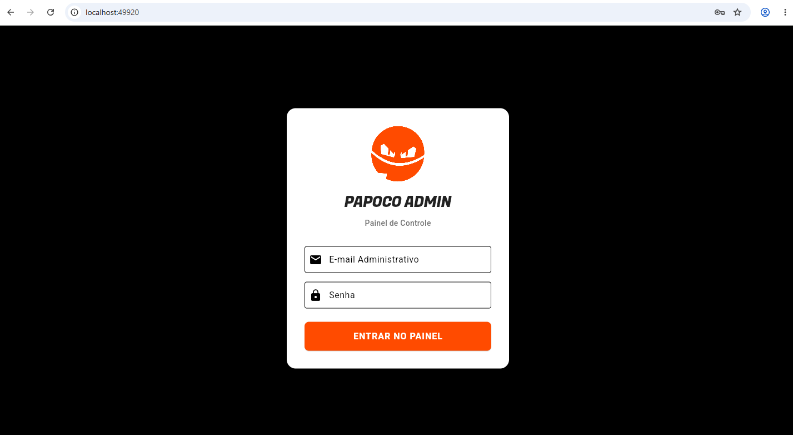
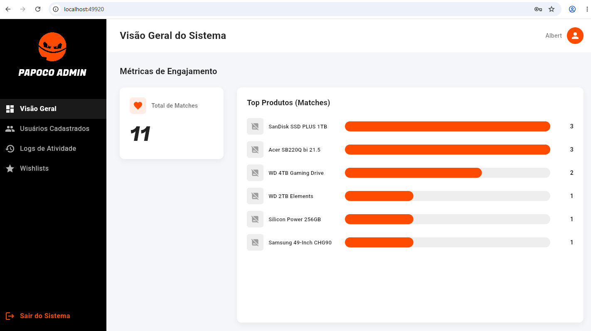
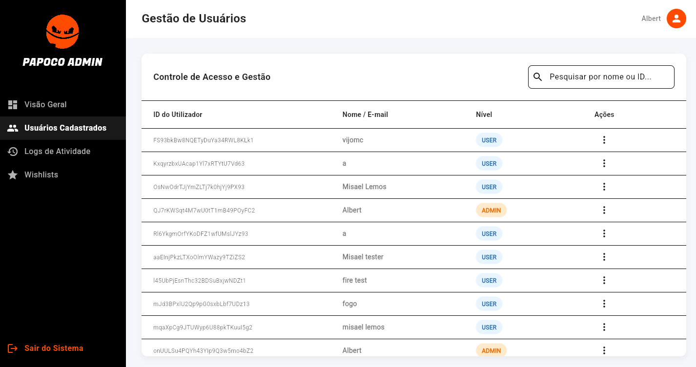
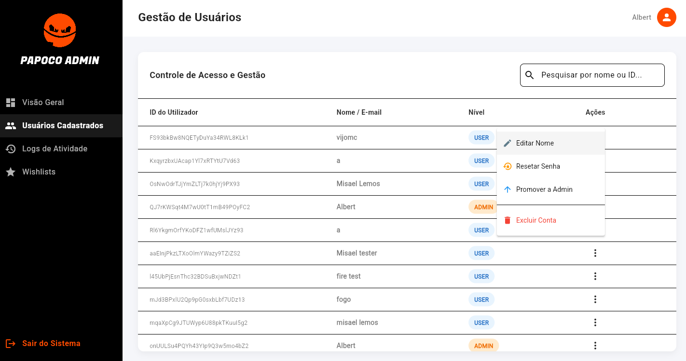
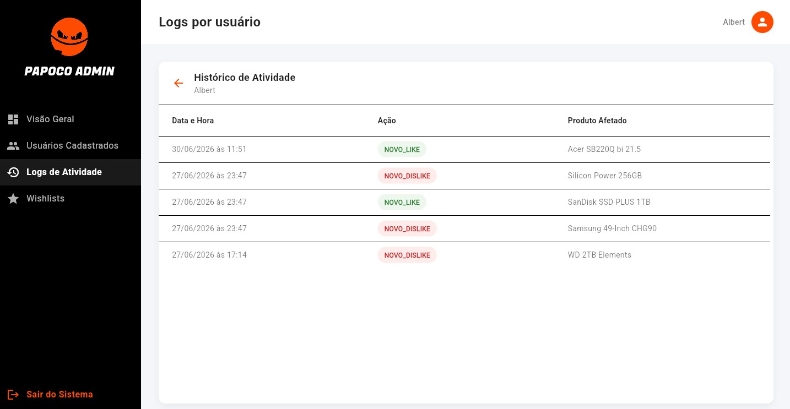
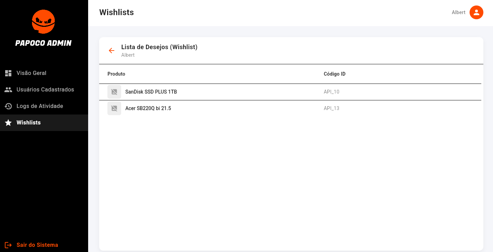

#  Papoco Admin Panel

O **Papoco Admin** é um painel de controle administrativo responsivo desenvolvido para gerenciar o ecossistema do aplicativo Papoco. Criado com foco na experiência do usuário e eficiência na gestão de dados, o sistema permite auditoria em tempo real, controle de acesso e análise de engajamento de produtos.

##  Telas do Sistema

<!-- SUBSTITUA OS LINKS ABAIXO PELOS CAMINHOS DAS SUAS IMAGENS -->
<div align="center">
  
  <p><i>Tela de Autenticação Segura</i></p>
  <br>
  
  <p><i>Dashboard e Métricas de Engajamento</i></p>
  <br>
  
  
  <p><i>Painel de Gestão e Controle de Acesso</i></p>
  
  
  <p><i>Painel de logs de usuarios</i></p>
  
  
  <p><i>Painel Lista de desejos por usuário</i></p>
</div>

##  Funcionalidades Principais

* ** Autenticação Segura:** Login integrado ao Firebase Auth com verificação de privilégios. Apenas usuários com a flag `role: 'admin'` conseguem contornar o bloqueio de segurança e acessar o painel.
* ** Visão Geral (Dashboard):** Acompanhamento de métricas de engajamento e exibição do ranking de produtos com maior número de interações (Matches), consumindo dados dinâmicos mapeados a partir da FakeStore API.
* ** Gestão de Usuários (CRUD):** 
  * Pesquisa em tempo real (Filtro por nome, ID ou e-mail).
  * Edição de dados cadastrais.
  * Promoção/Rebaixamento de privilégios (`ADMIN` ↔ `USER`).
  * Disparo automático de e-mail para redefinição de senha.
  * Exclusão segura de contas.
* ** Auditoria de Logs:** Sistema de rastreamento de ações (`NOVO_LIKE`, `NOVO_DISLIKE`) isolado por usuário, com tradução inteligente de IDs de sistema para nomes reais de produtos.
* ** Wishlists:** Visualização detalhada da lista de desejos (produtos favoritados) de cada usuário da plataforma.

##  Tecnologias Utilizadas

* **Framework:** [Flutter Web](https://flutter.dev/multi-platform/web)
* **Linguagem:** Dart
* **Backend as a Service (BaaS):** Firebase
  * **Firebase Authentication** (Gestão de credenciais)
  * **Cloud Firestore** (Banco de dados NoSQL reativo)
* **Design System:** Material Design 3 (UI focada em High Contrast: Preto Metálico e Laranja Papoco).
* **Tipografia:** Google Fonts (`Fugaz One` para marca e `Roboto` para leitura).

##  Arquitetura do Banco de Dados (Firestore)

A modelagem de dados foi otimizada para consultas modulares:

* Coleção Raiz: `users/`
  * Documento: `{uid}` -> Contém `nome`, `email`, `role`.
  * Subcoleção: `wishlist/` -> Itens que o usuário deu "Match".
* Coleção Raiz: `admin_logs/`
  * Documento: `{uid}`
  * Subcoleção: `logs/` -> Histórico cronológico de ações (Like/Dislike).

##  Como Executar o Projeto Localmente

**Pré-requisitos:** Ter o [Flutter SDK](https://docs.flutter.dev/get-started/install) instalado e configurado em sua máquina, além do Google Chrome para rodar a versão web.

1. Clone este repositório:
   ```bash
   git clone [https://github.com/SEU-USUARIO/papoco-admin.git](https://github.com/SEU-USUARIO/papoco-admin.git)

2. Acesse a pasta do projeto:
    ```bash
    cd papoco-admin

3. Instale as dependências:
    ```bash
    flutter pub get

3. Execute o projeto no Chrome:
    ```bash
    flutter run -d chrome